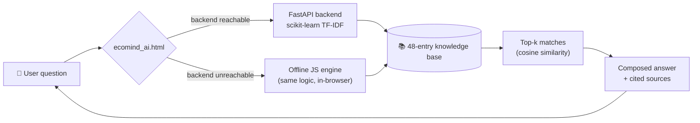

<div align="center">

# 🌱 EcoMind AI

### Retrieval-Augmented Sustainability Assistant

[](https://git.io/typing-svg)

<br>


**Built for the 1M1B AI for Sustainability Virtual Internship**
*(in collaboration with IBM SkillsBuild & AICTE)*

`SDG 13` `SDG 7` `SDG 12`

</div>

---

## ✨ What is this?

EcoMind AI answers free-text sustainability questions — *"how do I lower my energy bill?"*, *"is an EV actually better for the climate?"* — by retrieving the most relevant facts from a curated 48-entry knowledge base and composing a grounded answer, **citing exactly which topics it drew from**. Nothing is invented. If it doesn't know, it says so.

Bundled alongside it: a **carbon footprint estimator** that turns a few habit inputs into an annual CO2e estimate, broken down by category, with one AI-retrieved tip targeted at your biggest contributor.

<div align="center">
<table>
<tr>
<td align="center" width="200">🔍<br><b>Retrieval, not generation</b><br><sub>TF-IDF + cosine similarity</sub></td>
<td align="center" width="200">📎<br><b>Every answer cited</b><br><sub>See exactly what informed it</sub></td>
<td align="center" width="200">🌐<br><b>Works two ways</b><br><sub>Real backend or fully offline</sub></td>
<td align="center" width="200">🧪<br><b>Tested</b><br><sub>36 passing pytest cases</sub></td>
</tr>
</table>
</div>

---

## 🖥️ Try it in 10 seconds

No install, no server, no signup — just open the file:

```bash
git clone https://github.com/YOUR-USERNAME/ecomind-ai.git
cd ecomind-ai
open ecomind_ai.html          # macOS
start ecomind_ai.html         # Windows
xdg-open ecomind_ai.html      # Linux
```

It runs entirely client-side in **Offline mode** using a JavaScript port of the same retrieval engine — perfect for a zero-setup live demo.

---

## ⚙️ Run the real ML backend

For the full `scikit-learn` TF-IDF + cosine-similarity pipeline behind a REST API:

```bash
cd ecomind_backend
python -m venv venv
source venv/bin/activate        # Windows: venv\Scripts\activate
pip install -r requirements.txt
uvicorn app:app --reload
```

Then reopen `ecomind_ai.html` — the sidebar badge will flip to **🟢 Connected to backend**, and every question now hits the real API.

```bash
curl -X POST http://127.0.0.1:8000/chat \
  -H "Content-Type: application/json" \
  -d '{"query": "how can I lower my energy bill"}'
```

Full backend docs, configuration, logging, and test instructions live in [`ecomind_backend/README.md`](./ecomind_backend/README.md).

---

## 🧠 How it works



Both engines run the *identical* retrieval algorithm and share the same stopword list, so answers are consistent whether you're online or offline — the only thing that changes is where the math happens.

---

## 📂 Repository structure

```
ecomind-ai/
├── ecomind_ai.html            Standalone browser demo (offline-capable frontend)
├── ecomind_ai_deck.pptx       Submission slide deck
└── ecomind_backend/
    ├── app.py                 FastAPI app — /chat, /footprint, /topics, /health
    ├── rag.py                 RAG engine — TF-IDF retrieval + answer composition
    ├── config.py              Centralized, env-overridable settings
    ├── logging_config.py      Structured console logging
    ├── data/kb.json            48-entry sustainability knowledge base
    ├── tests/                  pytest unit + API integration tests
    ├── requirements.txt
    └── README.md               Full backend documentation
```

---

## 🌍 Coverage

<div align="center">

| 💡 Energy | 💧 Water | ♻️ Waste | 🚲 Transport |
|:---:|:---:|:---:|:---:|
| 🥗 Food | 🦋 Biodiversity | 🌡️ Climate | 🏙️ Cities & Policy |

</div>

---

## 🤝 Responsible AI

- **Transparency** — every answer returns which knowledge-base entries it matched, with similarity scores
- **No hallucination** — the assistant only ever composes from its curated knowledge base; unmatched questions get an honest "I don't have a confident match" instead of a guess
- **Fairness** — footprint math uses global average emission factors, not one country's assumptions
- **Privacy** — no query or footprint input is stored; request logs capture only path/status/timing by default

---

<div align="center">

### 🌿 Built with intention, not just implementation.

<sub>1M1B AI for Sustainability Virtual Internship · IBM SkillsBuild & AICTE</sub>

</div>
